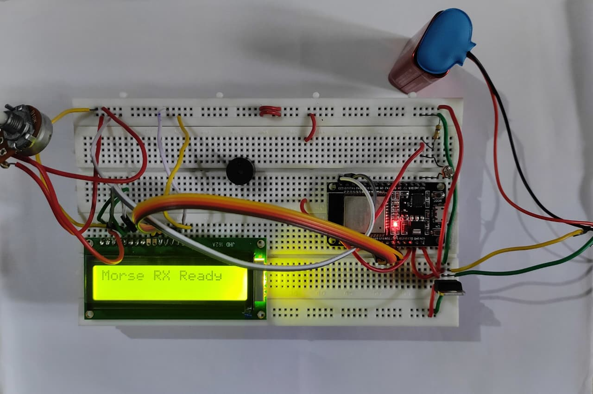
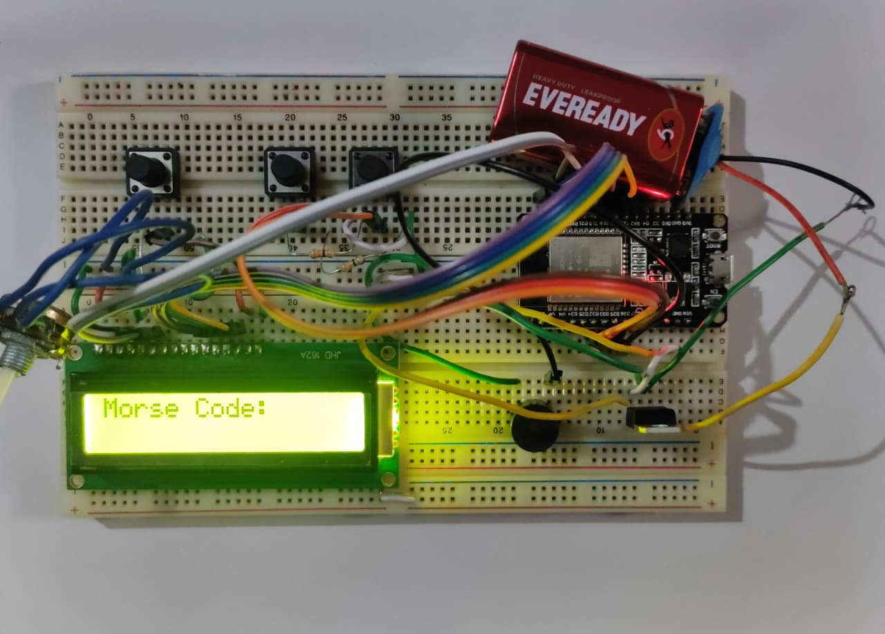

# Morse Code Communication System using ESP32 + Laser

A wireless morse code communication system implemented using two ESP32 microcontrollers, a laser transmitter, a laser receiver (LDR/photodiode module), and LCD displays. The system converts button input into Morse code, transmits pulses through a laser beam, receives and decodes the pulses into alphabet characters, and displays the output on LCD.

> [!NOTE]
> Hardware project | ESP32 | C/C++

---

## Demo
<table>
  <tr>
    <td align="center"></td>
    <td align="center"></td>
  </tr>
</table>
---

## Features

- Dot and dash input using push buttons
- Dedicated letter-gap button to signal end of each character
- Morse code encoding and decoding on ESP32 (A–Z, 0–9)
- Laser-based optical transmission
- LDR/photodiode-based reception with auto-calibration on startup
- Hysteresis on sensor threshold to prevent signal chatter
- Automatic letter-gap timeout on receiver for hands-free decoding
- Scrolling LCD output on both TX and RX sides — no clipping
- Buzzer feedback on receiver for each received pulse
- Serial Monitor debug output on both boards (115200 baud)
- Simple, reliable and low-cost communication

---

## Hardware Components

### Transmitter Side

| Component | Quantity |
|---|---|
| ESP32 Dev Board | 1 |
| Laser Transmitter Module | 1 |
| 16x2 LCD Display | 1 |
| Push Buttons | 3 |
| Power Supply / Battery | 1 |
| Resistors & Jumper Wires | — |

### Receiver Side

| Component | Quantity |
|---|---|
| ESP32 Dev Board | 1 |
| LDR / Photodiode Sensor Module | 1 |
| 16x2 LCD Display | 1 |
| Buzzer | 1 |
| Power Supply / Battery | 1 |
| Resistors & Jumper Wires | — |

---

## System Architecture

The system runs two independent ESP32 boards over a single laser link:

```
Transmitter ESP32
├── Reads: Dot button, Dash button, Letter button
├── Drives: Laser module (timed ON/OFF pulses)
└── Displays: Current symbol (row 1) + decoded message (row 0) on LCD

        [ Laser Beam ]

Receiver ESP32
├── Reads: LDR / Photodiode (analog)
├── Drives: Buzzer (beep per pulse)
└── Displays: Raw morse (row 1) + decoded message (row 0) on LCD
```

> The suction motor on the vacuum cleaner equivalent here is the laser — it runs every time a button is pressed with no additional control layer needed. Decoding happens independently on each side.

---

## Block Diagram


---

## Pin Configuration

### Transmitter — ESP32

| Component | Pin |
|---|---|
| Dot Button | 4 |
| Dash Button | 5 |
| Letter Button | 18 |
| Laser Module | 2 |
| LCD (RS, E, D4, D5, D6, D7) | GPIO 13, 12, 14, 27, 26, 25 |

### Receiver — ESP32

| Component | Pin |
|---|---|
| LDR / Photodiode | 34 |
| Buzzer | 15 |
| LCD (RS, E, D4, D5, D6, D7) | GPIO 13, 12, 14, 27, 26, 25 |

> [!NOTE]
> The LDR is connected to GPIO 34 which is an input-only analog pin on the ESP32 — do not use it as output.

---

## Navigation Logic

The receiver follows a priority-based decision sequence on every loop iteration:

```
1. Read analog sensor value
2. Laser ON detected (value > threshold + hysteresis)?  → Start pulse timer, buzz ON
3. Laser OFF detected (value < threshold - hysteresis)? → Stop timer, classify pulse
       pulse duration < 400 ms → DOT
       pulse duration ≥ 400 ms → DASH
4. Silence > 800 ms with symbol buffered?              → Decode symbol → append to message
5. Update LCD row 0 (message) and row 1 (raw morse)
```

**Obstacle threshold equivalent:** 400 ms midpoint (configurable via `thresholdMs` constant — set as midpoint of `dotTime` and `dashTime`)

---

## Key Timing Constants

| Parameter | Value | Notes |
|---|---|---|
| Dot duration | 200 ms | Laser ON for a dot |
| Dash duration | 600 ms | Laser ON for a dash |
| Symbol gap | 200 ms | Silence between dots/dashes within one letter |
| Letter gap | 800 ms | Silence that signals end of a letter |
| Decode threshold | 400 ms | Midpoint — pulses below = dot, above = dash |
| Hysteresis | ±150 counts | Sensor band above/below threshold to flip state |
| Debounce delay | 50 ms | Minimum time between valid button presses |

All timing constants are defined at the top of each `.ino` file and kept in sync between TX and RX.

---

## How to Build and Flash

1. Wire the transmitter components according to the Transmitter pin table above
2. Wire the receiver components according to the Receiver pin table above
3. Open `Morse_code_transmitter/Morse_code_transmitter.ino` in **Arduino IDE**
4. Select **Board:** ESP32 Dev Module and the correct **COM Port**, then upload
5. Open `Morse_code_receiver/Morse_code_receiver.ino`, select the second COM Port, then upload
6. Open **Serial Monitor** at `9600 baud` on either board to watch live sensor readings
7. Power both boards, align the laser beam to the LDR, and begin transmitting

> [!TIP]
> Align the laser so it hits the centre of the LDR module directly. Even a few millimetres of misalignment can reduce the received signal strength below the detection threshold.

---

## How It Works

### Laser Transmission
The transmitter fires the laser for a timed duration on each button press — 200 ms for a dot, 600 ms for a dash. A 200 ms OFF gap follows each symbol element. When the LETTER button is pressed, an 800 ms silence is held to signal end of character.

### LDR / Photodiode Reception
On startup the receiver samples 100 ambient light readings with the laser OFF, averages them, and adds a 300-count margin to set the detection threshold automatically. This means the receiver adapts to any room lighting without manual tuning.

The sensor uses a hysteresis band of ±150 counts around the threshold — the laser must exceed `threshold + 150` to register ON, and drop below `threshold - 150` to register OFF. This prevents rapid toggling when the signal sits near the boundary.

### Pulse Classification
```
pulse duration (ms) = laser OFF timestamp − laser ON timestamp
dot  → duration < 400 ms
dash → duration ≥ 400 ms
```

The 400 ms midpoint is computed directly from the transmitter timing constants so both sides stay in sync.

### Morse Decoding
After 800 ms of silence the buffered symbol (e.g. `.-`) is looked up in a 36-entry table (A–Z, 0–9) and the decoded character is appended to the message string on LCD row 0. The symbol buffer resets for the next character.

### LCD Display
Both boards show the same two-row format:
- **Row 0 — MSG:** decoded message, scrolls left when longer than 12 characters
- **Row 1 — SYM:** raw dots and dashes of the current symbol being built, scrolls left

---

## Known Limitations

> [!CAUTION]
> The laser beam must maintain line-of-sight between TX and RX at all times. Any object crossing the beam will be interpreted as a pulse.

- No PWM or variable laser power — transmission is fixed intensity only
- Fixed timing constants may need tuning if the ESP32 loop has added processing load
- No memory of previously sent messages — display clears on power cycle
- Suction motor equivalent (laser) runs at a single speed — no intensity encoding

---

## Potential Improvements

- WiFi / Bluetooth Morse messaging to remove line-of-sight requirement
- Higher-range laser module for outdoor or long-distance use
- Error correction / parity check between TX and RX
- Word-gap detection and space character support
- Mobile app integration for displaying received messages
- Replace fixed timing with adaptive calibration based on measured round-trip latency

---

## Tools Used

| Tool | Purpose |
|---|---|
| Arduino IDE | Firmware development |
| Serial Monitor | Real-time sensor debugging |
| Proteus | Circuit simulation before hardware build |

---

## Author

**Amarnath K R**  
[GitHub](https://github.com/kramarnath)
